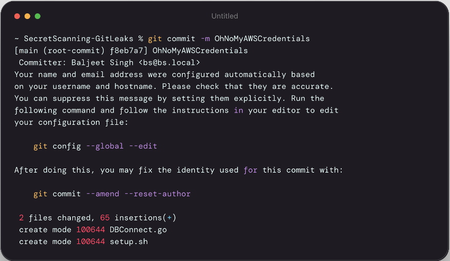
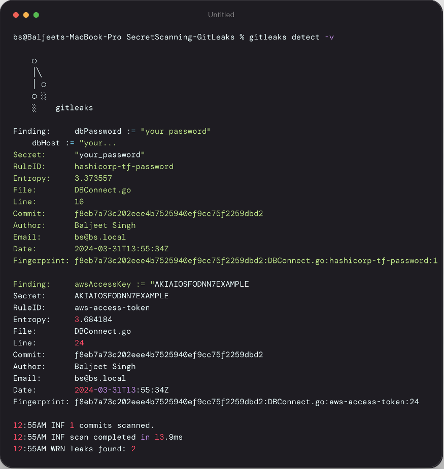
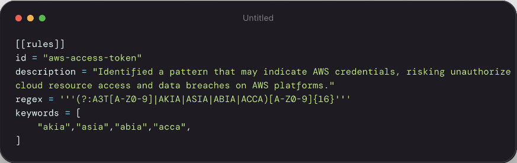
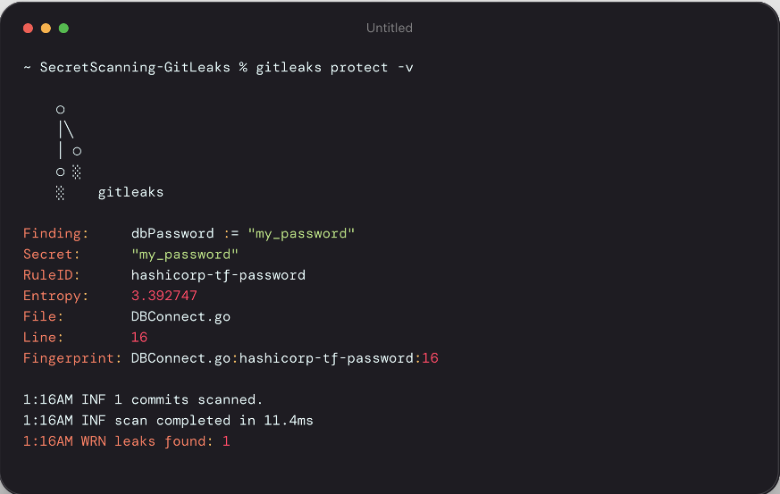
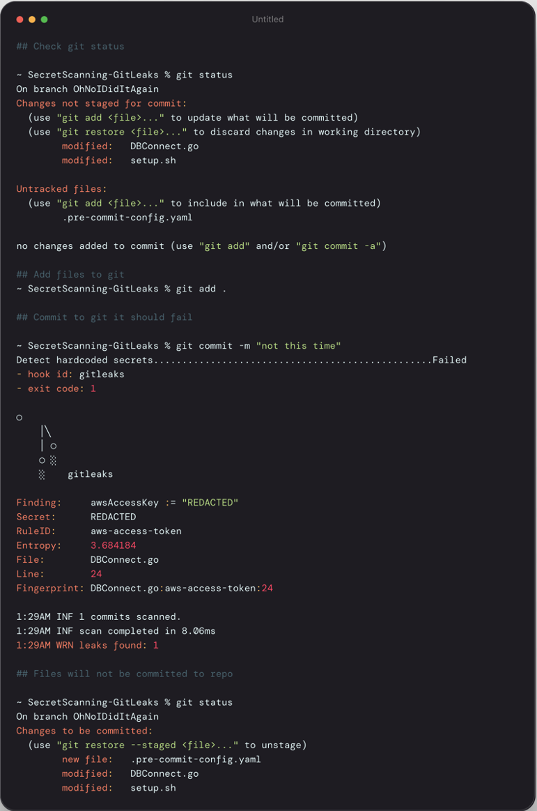

# ZYG-Gitleaks-SecretScanning
A demo how we can detect, protect and Prevent committing secrets on repositories using GitLeaks

---
Title: "Enhancing Repository Security with Gitleaks and Pre-commit: A Comprehensive Guide"

author: "Baljeet Singh"

date: "2024-04-01"

---

# Enhancing Repository Security with Gitleaks and Pre-commit

*I would love to see world where dynamic and short lived secrets are reality, truth is we have a lot of work to do before we get there.*

In today's digital era, where code repositories serve as the backbone for countless projects, the importance of security cannot be overstated. Sensitive information, inadvertently committed to a repository, can lead to catastrophic security breaches. This blog post aims to introduce you to two powerful open-source tools, **Gitleaks** and **Pre-commit**, which, when combined, form a formidable defense against the accidental commit of secrets into your repositories.

## Understanding the Risk

Before diving into the solutions, it's essential to grasp the nature of the risk. Secrets such as passwords, API keys, and tokens, if exposed, can give attackers unauthorized access to databases, external services, and other critical resources. Given the fast-paced nature of development environments, it's surprisingly easy to commit these secrets accidentally.

## Enter Gitleaks: Your First Line of Defense

[Gitleaks](https://github.com/zricethezav/gitleaks) is a versatile tool designed to scan your codebase for exposed secrets. It works by inspecting the history of your git repositories to find secrets pushed to your repository. Gitleaks offers comprehensive scanning capabilities, supporting a wide range of secret patterns out of the box while also providing the flexibility to define custom patterns.


## Pre-commit: Preventing Mistakes Before They Happen

While Gitleaks is excellent at detecting secrets, wouldn't it be better to prevent them from being committed in the first place? Here's where [Pre-commit](https://pre-commit.com/) comes into play. Pre-commit is a framework for managing and maintaining multi-language pre-commit hooks. It allows you to enforce a wide range of policies, including secret detection, code formatting, and syntax checks, before a commit is finalized.

## Combining Gitleaks with Pre-commit for Maximum Security

Integrating Gitleaks with Pre-commit gives you a powerful mechanism to prevent secrets from ever being committed. Here's a simplified guide to setting up both tools in your project:

## Demo:

Here's a quick demo on how you can use these tools on your development environment to protect your secrets. 

### 1 :  Install Pre-commit and Gitleaks

Provided I am a Mac user a lot of these steps will closely associated with Mac users, however the links share above share how you can install these tools on other environments.

```
## install Gitleaks
brew install gitleaks

## install pre-commit
brew install pre-commit 
```

### 2 :  Code

Below is quick code snippet of a `Go` file trying to connect to AWS RDS server. *`A lot can go wrong here`*.


### 3 : Commit 

Commit your changes on a branch



### 4 : DETECT 

Lets run Gitleaks and see if we accidentally committed any secret with this code. 



As you can see `Gitleaks` has came up with two findings where we are accidentally committing out `DB Password and AWS Access keys`. It does great job with pinpointing the file, line, author and date so you can quickly check when this happened. 

If you are wondering how Gitleaks did that, its simple Regex match based on rules defined in [Gitleaks Config](https://github.com/gitleaks/gitleaks/blob/master/config/gitleaks.toml). You can update this or add your own rules based on your custom needs.

For example, here the rule to capture AWS Access Token:



### 5 : Protect

Great, it works. But, how do I protect this from happening. Can I capture these before I commit to git?
Sure you can. This is where Gitleaks Protect comes into play. 

In this case, before you commit your changes to branch. You can run a `gitleaks protect` command to scan all the files added with changes and capture any secret which we might be exposing as a part of commit. 

Here's a quick example of how it capture `dbPassword` secret which I changed in this branch and show warnings before I commit these changed. 



### 6 : Prevent

Nice, but what if I accidentally missed running `Protect` and miss these warnings? How can I run this scanning automatically at time of adding files/changes to the branch. 

This is where a tool called `pre-commit` comes into play. You can create a webhook on `pre-commit` with `Gitleaks` which will help run this scan automatically at time you are adding files/changes to git. 

To configure hook you need to create `.pre-commit-config.yaml` file with following values:

```
repos:
  - repo: https://github.com/gitleaks/gitleaks
    rev: v8.18.2
    hooks:
      - id: gitleaks
```

Great, now lets make changes to our `Go` file and try again:



As you can see above, Gitleaks reported `Failed` on my attempt to commit these files because of secret detected in our code. 

## Conclusion
Incorporating Gitleaks and Pre-commit into your development workflow can significantly reduce the risk of accidental secret exposure. While no tool is foolproof, the combination of Gitleaks' scanning capabilities and Pre-commit's preventive measures offers a robust solution to protect your codebase. Remember, in the realm of security, prevention is always better than cure.

We encourage you to integrate these tools into your projects, further customizing and expanding upon the configurations to meet your specific needs. Together, we can make our repositories safer, one commit at a time.