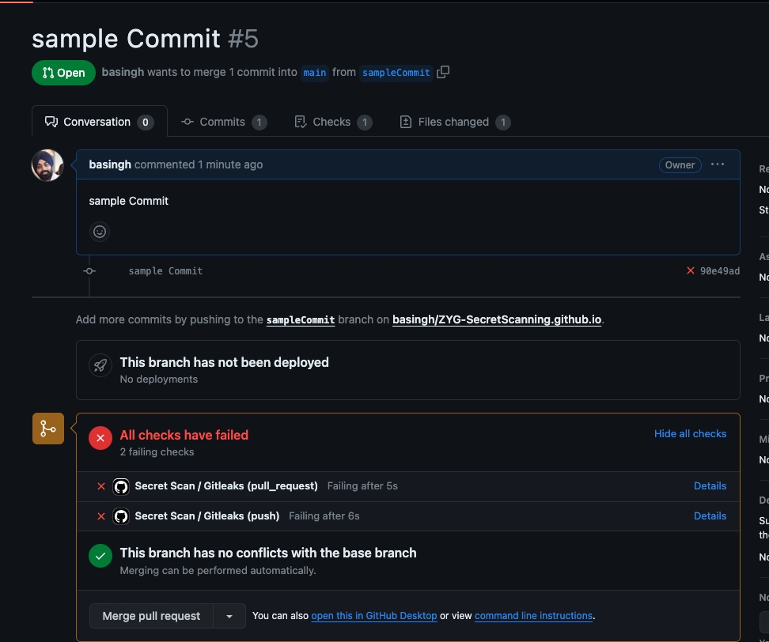
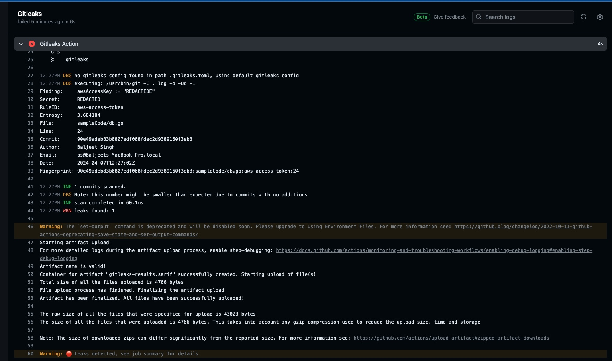
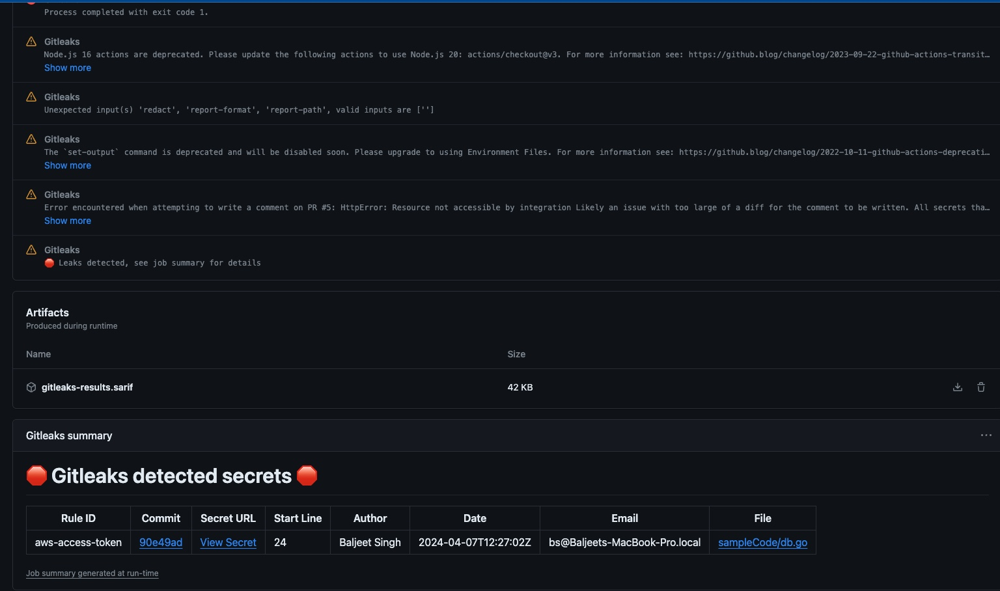
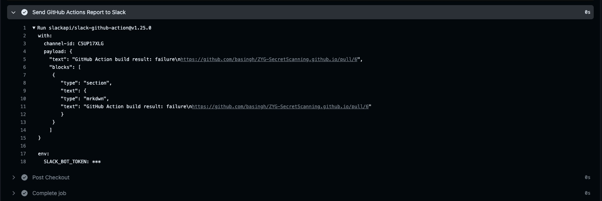
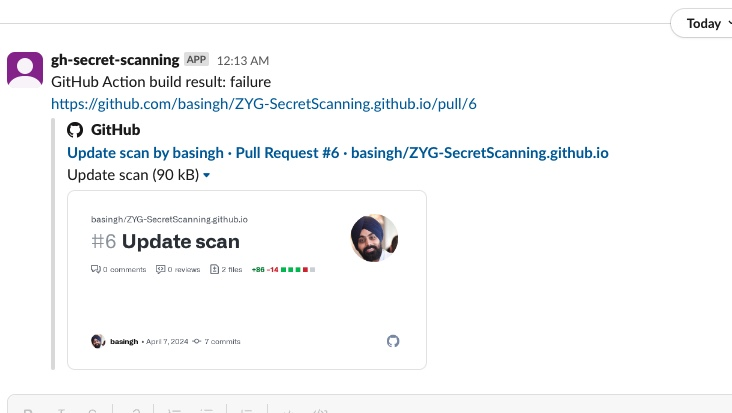

# Preventing Secret Leaks in GitHub Repositories with GitLeaks-Actions and Slack Alerts

This blog post will guide you through setting up a robust security mechanism using GitHub Actions, GitLeaks, and Slack notifications to prevent the accidental commitment of secrets into your GitHub repositories.

## Introduction to GitLeaks

GitLeaks is a powerful, open-source tool designed to detect and prevent the leakage of sensitive information in your codebase. It scans your commits, branches, and repositories for secrets and can be integrated into your CI/CD pipeline to ensure your code is secure before it merges into the main branch.

<p align="center">

</p>

## Setting Up GitLeaks with GitHub Actions

GitHub Actions provides an excellent platform for automating your software workflows, including CI/CD, testing, and security scanning. Integrating GitLeaks into GitHub Actions can help catch secrets before they are committed to your repository.

### Step 1: Create a GitHub Actions Workflow

First, navigate to your GitHub repository, and under the **.github/workflows** directory, create a new YAML file, e.g., `gitleaks.yml`. This file will define your GitHub Actions workflow.

### Step 2: Define Your Workflow

In the `gitleaks.yml` file, define your workflow as follows:

```YAML
name: Secret Scan

on:
  push:
  pull_request:
  # schedule:
  #  - cron:  '0 0 * * *' # Runs every day at midnight or any time

jobs:
  gitleaks:
    runs-on: ubuntu-latest
    name: Gitleaks
    steps:
    - name: Checkout
      uses: actions/checkout@v3
      with:
        fetch-depth: 0
    - run: wget -O ./gitleaks.toml https://raw.githubusercontent.com/zricethezav/gitleaks/master/config/gitleaks.toml # download the default config
    - name: Gitleaks Action
      uses: gitleaks/gitleaks-action@v2
      env:
        GITHUB_TOKEN: ${{ secrets.GITHUB_TOKEN }}
```

This workflow triggers on push and pull requests events, checks out the code, and runs the GitLeaks Action to scan the codebase for secrets.

### Alerting Failures on Slack
Notifying your team when GitLeaks detects secrets can be crucial for rapid response. Slack, a popular collaboration tool, can be integrated to receive these alerts.

#### Step 1: Setup Slack Webhook
First, create a Slack Incoming Webhook:

You can refer to [slackapi/slack-github-action](https://github.com/slackapi/slack-github-action?tab=readme-ov-file#technique-2-slack-app) documentation to set this up. At the end of this you should have a `Bot Token`.

Copy the `Bot Token` for use in your GitHub Actions workflow.

#### Step 2: Update GitHub Actions Workflow
Modify your gitleaks.yml workflow to include a step for sending alerts to Slack when GitLeaks finds a secret. Add the following after the GitLeaks step:

```YAML    
- name: Send GitHub Actions Report to Slack
      if: ${{ failure() }}
      id: slack
      uses: slackapi/slack-github-action@v1.25.0
      with: 
        channel-id: 'C5UP17XLG'
        payload: |
            {
                "text": "GitHub Action build result: ${{ job.status }}\n${{ github.event.pull_request.html_url || github.event.head_commit.url }}",
                "blocks": [
                 {
                    "type": "section",
                    "text": {
                    "type": "mrkdwn",
                    "text": "GitHub Action build result: ${{ job.status }}\n${{ github.event.pull_request.html_url || github.event.head_commit.url }}"
                    }
                 }
                ]
            }
      env:
        SLACK_BOT_TOKEN: ${{ secrets.SLACK_BOT_TOKEN }}
```

Make sure to add your Slack bot token to your GitHub repository secrets with the name `SLACK_BOT_TOKEN`.

### Lets try this out

#### Dummy Credential file
Create a sample code file with dummy credentials in it. Commit and push this to Git repository. 

```Go
...
func main() {
    // Construct a connection string with dummy values
    dbUser := "your_username"
    dbPassword := "my_password"
    dbHost := "your_rds_endpoint"
    dbPort := 3306         // Assuming MySQL
    dbName := "your_database_name"

    connectionString := fmt.Sprintf("%s:%s@tcp(%s:%d)/%s", dbUser, dbPassword, dbHost, dbPort, dbName)

    // Create dummy AWS credentials with placeholders for security
    awsAccessKey := "XXXXXXXXXXXXXXXX"
    awsSecretKey := "XXXXXXXXXXXXXXXXXXXXXXXXXXXXXXXX"
    creds := credentials.NewStaticCredentials(awsAccessKey, awsSecretKey, "")

    // Create an AWS session for RDS authentication (even though it's not used for connection)
    sess, err := session.NewSession(&aws.Config{
        Credentials: creds,
        // Region: aws.String("your-region"), // Uncomment and set region if needed
    })
    if err != nil {
        fmt.Println("Error creating AWS session:", err)
        return
    }

    // Open a database connection
    db, err := sql.Open("mysql", connectionString)
    if err != nil {
        fmt.Println("Error connecting to database:", err)
        os.Exit(1)
    }
    defer db.Close()
...
```

#### Github Action blocked the pull request

<p align="center">

</p>


Lets look at the logs and see why its been blocked?

<p align="center">

</p>

You can dig deeper into logs and it will show you alert `Gitleaks detected secrets` along with bunch of information which will be helpful for further actions. 

<p align="center">

</p>

It will also show it attempt to send send message to Slack. 

<p align="center">

</p>

#### Great, lets check out Slack:

<p align="center">

</p>

Voila!! It works. 


### Conclusion
By integrating GitLeaks with GitHub Actions, you create a powerful defense against the accidental commitment of secrets into your repositories. Coupling this with Slack notifications ensures your team is immediately aware of any security lapses, allowing for swift action. For GRC purposes you can go further and integrate your case management system with this to open and track cases. 

`Cherry on top? You can use this info to automatically rotate these secrets. Try it out!`

Remember, in the realm of cybersecurity, prevention is always better than cure. This setup not only protects your sensitive information but also fosters a culture of security awareness within your team. Happy coding, and stay secure!
